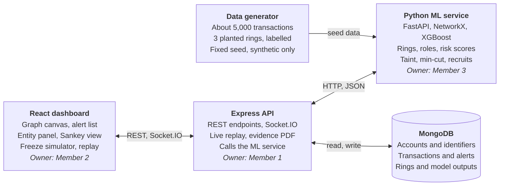

# Chakravyuh PRD: Fraud Network Intelligence

Oct 2, 2026 · Suman Jana · Team CryptRC

## Summary

Chakravyuh turns a flagged bank account into an investigator-ready case: the fraud ring, each account's role, the tainted money trail, the accounts to freeze, and the accounts likely to join next.

It is built by team CryptRC (two MERN developers, one AI/ML developer) for Hackspire 26, Cybersecurity theme, in 26 hours. "Chakravyuh" is a working name until the team confirms it.

**Pitch line:** Everyone else flags the account. We hand the investigator the ring, the next recruit, and the freeze order.

All data in the prototype is synthetic, and every number shown in the product is labelled as such.

## Problem

Fraud money moves through coordinated rings of accounts, but every existing tool looks at one account or one transfer at a time.

- **Scale.** India recorded 28 lakh digital payment fraud cases worth ₹22,931 crore in 2025 ([source](https://clearingpost.com/insights/i4c-rbih-mulehunter-ai-banking-fraud-detection-may-2026/)).
- **Flagging already exists.** RBI's MuleHunter.AI runs in 31 banks ([source](https://rmaindia.org/mulehunter-ai-rbis-ai-fraud-detection-system-now-live-across-31-banks/)), and the I4C Suspect Registry has shared over 32 lakh Layer-1 mule accounts ([source](https://impriinsights.in/indian-cyber-crime-coordination-centre-i4c-strengthening-indias-response-to-cyber-fraud-impri-impact-and-policy-research-institute/)).
- **The case does not.** Investigators get a list of accounts, not the ring structure, the controller, or a view of what to freeze first.
- **Freezes are blunt.** Whole accounts get frozen when only part of the balance is linked to fraud, and courts have started narrowing such freezes to the tainted sum ([The Ken](https://the-ken.com/story/flagged-3m-mule-accounts-declined-rs-25k-cr-in-fraud-transactions-then-who-knows/)).
- **Detection is reactive.** An account enters the registry after a complaint, by which time the money has usually moved on.

The gap we target is the step after the flag: evidence, proportion, and prediction.

## Goals, non-goals and success metrics

The goal for the 26 hours is one fraud scenario that runs live, end to end, in under three minutes.

**Goals**

- Detect planted fraud rings from identity and transaction data, and show each account's role.
- Show that identity features improve detection (V2 beats V1) with a results table.
- Ship at least two differentiators working in the demo: taint tracing and the freeze optimiser.
- Flag one account as a likely recruit before it transacts with the ring.

**Non-goals**

- Real bank data or integration with any live system.
- Production scale, real-time streaming infrastructure, or Neo4j.
- Temporal GNN or GAT models (GraphSAGE is a stretch item only).
- Full authentication and role-based access; a view toggle is enough.
- Mobile layout.

**Success metrics**

These are targets to validate during the build, not results.

| Metric | Target |
| --- | --- |
| Planted rings recovered in the demo dataset | 3 of 3 |
| Ring members recovered on a held-out ring pattern | 80% or more |
| Account-level PR-AUC | V2 higher than V1 on a time-split test set |
| Graph load time for 5,000 transactions | Under 2 seconds |
| Freeze optimiser response time | Under 1 second |
| Full demo run without manual fixes | Twice in rehearsal |

## Users and user stories

The primary user is a cyber-cell investigator working a complaint; the secondary user is a bank fraud analyst deciding what to freeze.

| ID | As a | I want to | So that | Feature |
| --- | --- | --- | --- | --- |
| U1 | Investigator | open an alert and see the whole ring around the flagged account | I understand the operation, not one account | F4, F7 |
| U2 | Investigator | see each account's role and the rule behind it | I know who to pursue first | F5 |
| U3 | Investigator | see why an account was flagged, in plain signals | I can defend the finding | F7 |
| U4 | Investigator | follow the victim's money hop by hop | I know where it went and how much is left | F8 |
| U5 | Bank analyst | get the smallest set of accounts to freeze | I stop the most money with the least disruption | F9 |
| U6 | Bank analyst | see how much of each balance is tainted | I place a proportionate lien, not a blanket freeze | F8 |
| U7 | Investigator | be warned about accounts likely to join the ring | I act before they move money | F10 |
| U8 | Investigator | export the case as one document | I can hand it to a bank or a court | F12 |

## Requirements

Seven P0 features make the demo run, five P1 features make it different, and P2 is built only if P0 and P1 are done by hour 20.

### P0: the demo depends on these

| ID | Feature | Acceptance criteria | Owner |
| --- | --- | --- | --- |
| F1 | Synthetic data generator | About 5,000 transactions and 600 accounts with 3 planted rings (fan-out, relay chain, shared-device cluster), ground-truth labels, and a fixed seed | Member 3 |
| F2 | Graph build and features | Accounts, devices, phones and IPs as nodes; per-account velocity, pass-through ratio, counterparty diversity, account age and shared-identifier counts | Member 3 |
| F3 | Risk models V1 and V2 | XGBoost on transaction features (V1) and with identity features added (V2); metrics table on a time-split test set | Member 3 |
| F4 | Ring discovery | Louvain communities on the combined graph; each ring has an ID, members, volume and risk score; all 3 planted rings found | Member 3 |
| F5 | Role inference | Rule-based source, mule, relay, cash-out and coordinator labels; each label shows the rule that fired | Member 3 |
| F6 | API and storage | Express API serves rings, accounts, transactions and alerts from MongoDB and calls the Python service | Member 1 |
| F7 | Investigator dashboard | Alert list, interactive graph coloured by role, and an entity panel with "why flagged" signals on click | Member 2 |

### P1: the differentiators

| ID | Feature | Acceptance criteria | Owner |
| --- | --- | --- | --- |
| F8 | Taint tracing | From a victim transaction, compute the tainted amount in every downstream account; show a Sankey view and a recommended lien per account | Members 3 and 2 |
| F9 | Freeze optimiser | Return up to k accounts whose freeze stops the most flow to cash-out nodes, with the percentage stopped; the user can toggle accounts and see the number change | Members 3 and 2 |
| F10 | Recruitment predictor | For accounts outside a ring, a probability of joining and the top 3 reasons; Account E is flagged before its first ring transaction | Member 3 |
| F11 | Live replay | Transactions stream over a socket at adjustable speed; the graph grows and an alert fires when a ring crosses the risk threshold | Members 1 and 2 |
| F12 | Evidence pack | One click produces a PDF with ring summary, roles, money trail, signals and recommended freezes | Member 1 |

### P2: stretch

| ID | Feature | Acceptance criteria | Owner |
| --- | --- | --- | --- |
| F13 | Intervention-window countdown | Estimated time to cash-out from the ring's median hop delay, shown on the alert | Member 3 |
| F14 | Drafted requests | Lien request and CCTV preservation request pre-filled from the case | Member 1 |
| F15 | Police and bank views | A toggle that changes which panels lead | Member 2 |
| F16 | GraphSAGE as V3 | Added as a third row in the metrics table | Member 3 |
| F17 | Plain-language case summary | An LLM writes a short summary from the structured signals only | Member 1 |
| F18 | Cash-out map (GIS) | ATM withdrawals and account home branches carry a city and coordinates; a Map tab in the ring view plots the ring's home branches and cash-out points; the entity panel shows distance from home branch to cash-out; falls back to a city table if map tiles do not load. Display only: no hotspot forecasting or routing | Members 3 and 2 |

## Demo scenario

The demo is one scripted fraud, replayed live, that touches every P0 and P1 feature in about two minutes.

1. **Replay starts.** A victim transfers ₹12 lakh to Account A. Transactions stream in and the graph grows on screen.
2. **The ring appears.** The money splits across nine accounts. Shared devices and phones link them, the cluster turns red and an alert fires.
3. **Roles.** The investigator opens the alert. Accounts are labelled source, mule, relay, cash-out and coordinator, each with its reason.
4. **Why flagged.** Clicking one mule shows its signals: 94% pass-through, a 3-day-old account, a device shared with four others.
5. **Taint.** The Sankey view follows the ₹12 lakh and shows the tainted amount sitting in each account.
6. **Freeze.** The optimiser picks three accounts that stop most of the remaining flow. Toggling one off shows the percentage drop.
7. **Next recruit.** Account E has not transacted with the ring yet, but shares a device with Account C. It is flagged with a probability and three reasons.
8. **Export.** One click produces the evidence pack.

The numbers in steps 4 to 7 are illustrative until the generator and models produce the real ones. Close on the V1 against V2 results table.

## System design

Three services, one per team member: a React dashboard, an Express API with MongoDB, and a Python ML service.

The dashboard never calls the ML service directly. Express stores precomputed model outputs in MongoDB, so the demo keeps working if the Python service stalls.

### Data model

| Collection | Key fields |
| --- | --- |
| accounts | id, holder, bank, home city and coordinates, opened date, features, risk V1, risk V2, ring id, role |
| identifiers | id, type (device, phone or IP), linked account ids |
| transactions | id, from, to, amount, timestamp, channel, city and coordinates (ATM only), fraud label |
| rings | id, member ids, volume, risk score, pattern |
| alerts | id, ring id, fired at, reason |

### API contract

Lock these shapes by hour 2. Member 1 serves mock responses until the Python service is ready.

| Endpoint | Returns |
| --- | --- |
| `GET /api/alerts` | Alerts with ring id, risk score and time fired |
| `GET /api/rings/:id` | Members, roles, edges, volume and risk score |
| `GET /api/accounts/:id` | Features, role, "why flagged" signals and linked identifiers |
| `GET /api/rings/:id/taint?txn=` | Tainted amount per account and Sankey links for one victim transaction |
| `POST /api/rings/:id/freeze` | Accounts to freeze and percentage of flow stopped, given k and any excluded accounts |
| `GET /api/rings/:id/recruits` | Candidate accounts with probability and top 3 reasons |
| `GET /api/rings/:id/evidence` | Evidence pack as a PDF |
| `GET /api/rings/:id/geo` (P2) | Home branches and cash-out points with coordinates, and the ring's geographic spread in km |
| Socket events: `replay:start`, `txn`, `alert` | Streamed transactions and alerts for live replay |

The Python service exposes four internal routes that only Express calls: `POST /pipeline/run`, `/taint`, `/mincut` and `/recruits`.

## ML approach and evaluation

Every model is a simple, explainable method on graph-derived features, so one person can build and debug all of it in 26 hours.

| Component | Method | Output |
| --- | --- | --- |
| Account risk V1 | XGBoost on transaction features only | Risk score per account |
| Account risk V2 | XGBoost with identity features added (shared devices, phones, IPs) | Risk score per account |
| Ring discovery | Louvain on a graph weighted by money flow and shared identifiers | Ring ID per account |
| Role inference | Rules on in-flow, out-flow, hold time and position in the ring | One role per ring member |
| Taint tracing | Proportional rule: each outgoing transfer carries the sender's tainted share of balance at that moment | Tainted rupees per account |
| Freeze optimiser | Minimum cut between receiving accounts and cash-out accounts, with accounts as the cut units | Accounts to freeze and flow stopped |
| Recruitment predictor | XGBoost on link features: shared identifiers, common neighbours, behavioural similarity to ring members | Probability of joining a ring |

**Evaluation rules**

- Split by time: train on earlier transactions, test on later ones. No feature may use future data.
- Hold one ring pattern out of training and report results on it separately.
- Report ring-level recall and account-level PR-AUC, not accuracy. Fraud is rare, so accuracy is misleading.
- State on the results slide that the data is synthetic and the rings were planted by us.

## Ownership and timeline

Feature work stops at hour 22, and the last four hours are for rehearsal and a recorded backup.

| Hours | Member 3 (AI/ML) | Member 1 (Backend) | Member 2 (Frontend) |
| --- | --- | --- | --- |
| 0–2 | Lock schema, API contract, demo script (all three) | Lock schema, API contract, demo script (all three) | Lock schema, API contract, demo script (all three) |
| 2–10 | Generator, graph, features, V1 and V2 models | Express, Mongo, ingestion, Python bridge, replay | Graph canvas, entity panel |
| 10–18 | Rings, roles, taint, freeze optimiser | Alerts and cases API, evidence PDF | Timeline scrubber, Sankey, freeze simulator |
| 18–22 | Recruitment predictor and metrics | Integration | Polish |
| 22–26 | Freeze, rehearse, record backup (all three) | Freeze, rehearse, record backup (all three) | Freeze, rehearse, record backup (all three) |

Member 1 as backend and Member 2 as frontend is an assumption; swap them if that suits the team better.

**Checkpoints**

- **Hour 2:** data schema, API contract and demo script agreed.
- **Hour 10:** P0 works end to end on mock or real data: an alert opens a ring with roles.
- **Hour 18:** taint tracing and freeze optimiser visible in the dashboard. Any P1 feature not started is cut.
- **Hour 20:** decide whether any P2 item is attempted.
- **Hour 22:** feature freeze.

## Risks and open questions

The biggest risk is integration between the Python service and the MERN app, so the API contract is locked in the first two hours.

| Risk | Mitigation |
| --- | --- |
| Integration between Python and Node slips late | Agree JSON shapes at hour 2; Member 1 builds against mock responses until the real service is ready |
| Member 3 is the only ML owner and is overloaded | P1 ML features are built in order F8, F9, F10; any not started by hour 18 is cut |
| Judges challenge results on self-generated data | Held-out ring pattern, time split, and saying so before being asked |
| Graph is unreadable on a projector | Demo dataset capped at about 5,000 transactions and 3 rings; collapse non-ring accounts by default |
| Live demo fails | Precompute all model outputs; keep a recorded backup of the full run |
| "How is this different from MuleHunter?" | It flags accounts; we build the case on top of the flag |

**Open questions**

- [ ] Is "Chakravyuh" the final name?
- [ ] What are the Hackspire 26 judging criteria and the pitch time limit?
- [ ] Can any code or data be prepared before the 26 hours start?
- [ ] Which member takes which MERN role (Member 1 backend, Member 2 frontend is assumed here)?
- [ ] Is internet access guaranteed at the venue, for the LLM summary and package installs?