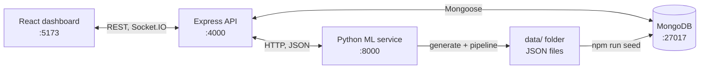
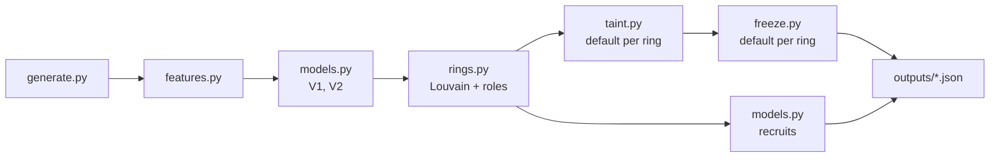

# Chakravyuh TRD: Technical Requirements

Oct 2, 2026 · Team CryptRC · Companion to `Chakravyuh_PRD.md`

## 1. Purpose and scope

This document says how each PRD feature (F1 to F18) is built: stack, repo layout, data schemas, algorithms, API shapes and test checks. It is written so that all three members can start coding in parallel after the hour-2 contract lock.

Everything runs locally on one laptop. All data is synthetic.

### Changes from the PRD

Three technical refinements came out of writing this document. Update the PRD if the team agrees.

| PRD item | Change | Why |
| --- | --- | --- |
| F1 data generator | Generate two extra datasets (train, test) besides the demo dataset | Three rings (about 30 fraud accounts) are too few to train XGBoost on |
| F9 freeze optimiser | Takes an `as_of` time and works on tainted money still in the ring | Money that has already left cannot be stopped; freezing the first account after it has emptied is meaningless |
| F12 evidence pack | `POST` instead of `GET` | The browser sends the graph snapshot image in the request body |

## 2. Tech stack

| Layer | Choice | Notes |
| --- | --- | --- |
| Frontend | React with Vite, Tailwind CSS | Member 2 |
| Graph view | Cytoscape.js (`react-cytoscapejs`) | Built-in force layouts, PNG export via `cy.png()` |
| Sankey view | `d3-sankey` or the Recharts `Sankey` component | Pick whichever Member 2 knows |
| Map (P2) | Leaflet (`react-leaflet`) with OpenStreetMap tiles | F18 only; tiles need internet and must show attribution |
| Realtime | Socket.IO (server and client) | Live replay |
| API | Node.js, Express, Mongoose | Member 1 |
| Database | MongoDB (local) | Stores seed data and precomputed outputs |
| PDF | `pdfkit` | No headless browser needed |
| ML service | Python, FastAPI, Uvicorn | Member 3 |
| Graph and ML | NetworkX, pandas, NumPy, XGBoost, scikit-learn | NetworkX in memory; no Neo4j |

Do not pin versions in this document. Each service keeps its own lockfile (`package-lock.json`, `requirements.txt`) created on the day.

## 3. Architecture



**Rules**

- The dashboard talks only to Express.
- The ML pipeline runs offline before the demo and writes JSON files. Express seeds MongoDB from those files.
- Only two features call Python live: taint tracing (F8) and the freeze optimiser (F9), because they depend on user input. Each has a cached default response in MongoDB as fallback.
- Express calls Python with a 3-second timeout. On timeout or error it returns the cached response with `"cached": true`.

## 4. Repository layout

```text
chakravyuh/
  README.md
  data/
    demo/   train/   test/        # generated, git-ignored
  ml/
    requirements.txt
    generate.py                   # F1
    features.py                   # F2
    models.py                     # F3, F10
    rings.py                      # F4, F5
    taint.py                      # F8
    freeze.py                     # F9
    geo.py                        # F18 (P2)
    pipeline.py                   # runs everything, writes data/<profile>/outputs
    service.py                    # FastAPI app
    tests/
  server/
    package.json
    src/
      index.js                    # Express + Socket.IO
      models/                     # Mongoose schemas
      routes/                     # alerts, rings, accounts, metrics, evidence
      replay.js                   # F11
      mlClient.js                 # HTTP client with timeout + fallback
      seed.js
      mocks/                      # contract-shaped JSON for hours 2 to 10
  client/
    package.json
    src/
      pages/        Dashboard.jsx, RingView.jsx
      components/   AlertList, GraphCanvas, EntityPanel, TaintSankey,
                    FreezePanel, RecruitList, ReplayBar, MetricsTable,
                    CashoutMap (P2)
      api.js  socket.js  store.js
```

## 5. Synthetic data (F1)

One generator, three profiles, all seeded.

| Profile | Accounts | Transactions | Days | Rings | Used for |
| --- | --- | --- | --- | --- | --- |
| `demo` | about 600 | about 5,000 | 7 | 3 (one per pattern A, B, C) plus Account E | The live demo |
| `train` | about 6,000 | about 50,000 | 30 | about 40 (patterns A, B, C) | Training V1, V2 and the recruitment model |
| `test` | about 3,000 | about 25,000 | 30 | about 20 (patterns A, B, C, D) | Metrics table; pattern D is never seen in training |

### Ring patterns

| Pattern | Shape | Timing |
| --- | --- | --- |
| A. Fan-out | One source receives the victim's money, splits it across 5 to 8 mules, which forward to 1 or 2 cash-out accounts | Each hop within 2 to 15 minutes |
| B. Relay chain | Source, then 3 or 4 relays in a line, then cash-out; each hop keeps a small cut | Each hop within 2 to 15 minutes |
| C. Shared-device cluster | 8 to 10 accounts opened within days of each other on 2 or 3 shared devices and phones; a coordinator is linked to most devices but moves little money | Bursts over 1 to 2 days |
| D. Scatter-gather (test only) | Fan-out to mules, then fan-in to one collector, then cash-out | Each hop within 2 to 15 minutes |

### Background behaviour

- Normal accounts receive salary credits, pay merchants and make occasional person-to-person transfers.
- 3 to 5% of normal accounts share a device or phone with one other normal account (families). Without this noise, "shares a device" would be a perfect fraud signal and the V2 result would be meaningless.
- Some normal accounts are new, and some forward money quickly (for example rent collection), for the same reason.

### Generator rules

- Every account has an `opening_balance`. No transaction may take a balance below zero.
- Cash-out is a transaction to the special account id `CASH` with channel `ATM`.
- Each ring member records `joined_at`, the time of its first ring-related link or transfer. The recruitment model needs this.
- Account E in the demo profile shares a device with a ring member and has **no** ring transactions.
- Every account has a `home` city and every `ATM` transaction has a `location`. These fields are generated from the start even though the map is P2; see section 11.
- Output files per profile: `accounts.json`, `identifiers.json`, `transactions.json`, `ground_truth.json`.

## 6. Data schemas

Field names below are the contract between all three services. IDs are strings.

### accounts

```json
{
  "_id": "ACC0042",
  "holder": "R. Sharma",
  "bank": "Bank B",
  "home": { "city": "Kolkata", "lat": 22.57, "lng": 88.36 },
  "opened_at": "2026-09-28T10:15:00Z",
  "opening_balance": 1200,
  "features": { "pass_through": 0.94, "median_hold_min": 6, "velocity_per_hr": 3.2 },
  "risk_v1": 0.41,
  "risk_v2": 0.88,
  "signals": [
    { "feature": "pass_through", "label": "Forwards 94% of what it receives", "weight": 0.31 }
  ],
  "ring_id": "RING01",
  "role": "mule",
  "role_reason": "Receives from source, forwards within 6 min"
}
```

### identifiers

```json
{ "_id": "DEV017", "type": "device", "account_ids": ["ACC0042", "ACC0051", "ACC0077"] }
```

`type` is one of `device`, `phone`, `ip`.

### transactions

```json
{
  "_id": "TXN003981",
  "from": "ACC0042",
  "to": "ACC0051",
  "amount": 48000,
  "ts": "2026-10-01T09:42:10Z",
  "channel": "UPI",
  "location": null,
  "is_fraud": true
}
```

`channel` is one of `UPI`, `IMPS`, `NEFT`, `ATM`. `location` is `{ "city", "lat", "lng" }` on `ATM` transactions and `null` otherwise. `is_fraud` is ground truth and is never sent to the dashboard.

### rings

```json
{
  "_id": "RING01",
  "member_ids": ["ACC0040", "ACC0042", "ACC0051"],
  "edges": [{ "from": "ACC0040", "to": "ACC0042", "amount": 150000, "count": 1 }],
  "identity_links": [{ "identifier": "DEV017", "account_ids": ["ACC0042", "ACC0051"] }],
  "volume": 1200000,
  "risk": 0.91,
  "geo_spread_km": 0,
  "victim_txn_ids": ["TXN003975"],
  "default_taint": {},
  "default_freeze": {}
}
```

### alerts

```json
{ "_id": "ALT01", "ring_id": "RING01", "fired_at": "2026-10-01T09:51:00Z", "reason": "5 linked accounts forwarding within minutes" }
```

### metrics (single document)

```json
{
  "rows": [
    { "model": "V1 transaction only", "pr_auc": 0.0, "ring_recall": 0.0, "pattern_d_recall": 0.0 },
    { "model": "V2 with identity", "pr_auc": 0.0, "ring_recall": 0.0, "pattern_d_recall": 0.0 }
  ],
  "note": "Synthetic data, rings planted by the team"
}
```

The zeros are placeholders. Real values come from `pipeline.py`.

## 7. ML service

### 7.1 Pipeline order



`python pipeline.py --profile demo` runs all steps and writes `data/demo/outputs/`. It must finish in under 60 seconds on the demo profile.

### 7.2 Features (F2)

Computed per account from its own transactions.

| Feature | Definition | Used in |
| --- | --- | --- |
| `amount_in`, `amount_out` | Total credited and debited | V1, V2 |
| `txn_in`, `txn_out` | Counts | V1, V2 |
| `pass_through` | `min(amount_out, amount_in) / max(amount_in, 1)` | V1, V2 |
| `median_hold_min` | Median minutes between a credit and the next debit | V1, V2 |
| `velocity_per_hr` | Transactions per hour between first and last activity | V1, V2 |
| `burst_10min` | Most transactions in any 10-minute window | V1, V2 |
| `counterparty_diversity` | Unique counterparties divided by transaction count | V1, V2 |
| `in_degree`, `out_degree` | Unique senders and receivers | V1, V2 |
| `account_age_days` | Days from `opened_at` to first transaction | V1, V2 |
| `atm_share` | Share of `amount_out` sent to `CASH` | V1, V2 |
| `shared_device_n`, `shared_phone_n`, `shared_ip_n` | Other accounts sharing any device, phone or IP | V2 only |
| `shared_any_new_n` | Sharing accounts that are under 14 days old | V2 only |
| `neighbour_risk_v1` | Mean V1 risk of accounts linked by a shared identifier | V2 only |
| `home_cashout_km` | Median distance from home branch to the account's ATM withdrawals | V2 only, when F18 is on |
| `cashout_city_n` | Distinct cities the account withdraws in | V2 only, when F18 is on |

### 7.3 Risk models (F3)

- Label: an account is positive if it belongs to a planted ring.
- V1 and V2 are both `XGBClassifier(n_estimators=200, max_depth=4, learning_rate=0.1, scale_pos_weight=neg/pos, eval_metric="aucpr")`. They differ only in the feature set.
- Train on the `train` profile. Report on the `test` profile. Score the `demo` profile.
- **Signals for "why flagged":** use XGBoost's built-in contributions, `booster.predict(DMatrix(X), pred_contribs=True)`, and keep the three largest positive contributions per account. Map each feature to a plain sentence through a small lookup table.

### 7.4 Ring discovery (F4)

1. Take accounts with `risk_v2 >= 0.5` and every account that shares an identifier or a transaction with them.
2. Build an undirected account graph on that set. Edge weight = `1.0` per shared identifier + `amount / median_ring_amount` capped at `3.0` for money flow.
3. Run `nx.community.louvain_communities(G, weight="weight", seed=42)`.
4. Keep communities with at least 3 accounts and mean `risk_v2 >= 0.6`. Each becomes a ring. Ring risk = mean member `risk_v2`.

Thresholds are starting values. Tune them on `train` until planted rings are recovered, then leave them fixed.

### 7.5 Role rules (F5)

Evaluate in this order inside each ring; the first match wins. Every role stores a `role_reason` sentence.

| Order | Role | Rule (starting thresholds) |
| --- | --- | --- |
| 1 | Coordinator | Shares identifiers with 3 or more ring members and carries under 10% of ring volume |
| 2 | Source | At least half its inflow comes from outside the ring, and it is the earliest active member |
| 3 | Cash-out | At least half its outflow goes to `CASH` |
| 4 | Mule | Receives directly from a source, `pass_through >= 0.8`, `median_hold_min < 30` |
| 5 | Relay | Both its senders and receivers are ring members |
| 6 | Member | Anything else |

### 7.6 Taint tracing (F8)

Proportional rule: money leaving an account carries the same tainted share as the account's balance at that moment.

```python
def trace(transactions, opening_balance, victim_txn_id, as_of=None):
    bal = dict(opening_balance)           # account -> balance
    taint = defaultdict(float)            # account -> tainted rupees
    flows = defaultdict(float)            # (from, to) -> tainted rupees moved
    started = False
    for t in sorted(transactions, key=lambda t: t["ts"]):
        if as_of and t["ts"] > as_of:
            break
        u, v, x = t["from"], t["to"], t["amount"]
        share = taint[u] / bal[u] if started and bal.get(u, 0) > 0 else 0.0
        moved = x * share
        bal[u] = bal.get(u, 0) - x
        bal[v] = bal.get(v, 0) + x
        taint[u] -= moved
        taint[v] += moved
        if moved > 0:
            flows[(u, v)] += moved
        if t["_id"] == victim_txn_id:
            taint[v] += x                  # the victim's money is 100% tainted
            started = True
    return bal, taint, flows
```

- Recommended lien per account = `min(taint[a], bal[a])`, rounded to the rupee.
- `taint["CASH"]` is money already withdrawn. Show it as "lost".
- Sankey links come from `flows`.
- **Invariant:** the sum of `taint` over all accounts including `CASH` equals the victim amount. This is the main unit test.

### 7.7 Freeze optimiser (F9)

The question: at time `as_of`, which k accounts should be frozen to secure the most tainted money?

1. Run `trace(..., as_of)` to get tainted balances now.
2. Build a directed graph of the ring's observed channels (who has sent to whom, including `CASH`).
3. **At-risk amount** = total tainted balance in accounts that still have a path to `CASH`.
4. Freezing an account removes it from the graph. Its own tainted balance is secured, and so is any tainted balance that can no longer reach `CASH`.
5. Choose the set of up to k accounts (excluding any in `exclude`) that secures the most. Rings are small, so try every combination when the ring has 15 accounts or fewer; otherwise pick greedily one account at a time.
6. Return the accounts, `secured`, `at_risk_before` and `pct_stopped = secured / at_risk_before`.

This is a minimum-cut problem with accounts as the cut units. Brute force gives the exact answer at this size and is easier to debug than a max-flow formulation.

Assumption to state if asked: a channel that has been used once can carry any amount again.

### 7.6 Taint tracing (F8)

Taint tracing follows the victim's money through the transaction graph while preserving the **exact rupee amount** at every stage.

#### Money precision rule

All monetary values used internally by the taint engine MUST be stored as **integer paise**.

- ₹1 = 100 paise
- No floating-point arithmetic is used for balances, transaction amounts or taint amounts.
- The UI converts paise to formatted rupee values only for display.
- This prevents floating-point rounding errors across multiple transaction hops.

#### Proportional taint rule

Money leaving an account carries the same tainted proportion as the account's balance at that moment.

For each outgoing transaction:

```python
moved = (amount_paise * taint_paise[u]) // balance_paise[u]
```

The result is an integer number of paise.

Any fractional remainder is retained by the sending account as taint. This guarantees that no tainted money is created or destroyed by rounding.

```python
def trace(transactions, opening_balance, victim_txn_id, as_of=None):

    bal = dict(opening_balance)       # account -> integer paise
    taint = defaultdict(int)          # account -> integer tainted paise
    flows = defaultdict(int)          # (from, to) -> integer tainted paise

    started = False

    for t in sorted(transactions, key=lambda t: t["ts"]):

        if as_of and t["ts"] > as_of:
            break

        u = t["from"]
        v = t["to"]
        x = t["amount_paise"]

        # Proportion of the sender's current balance that is tainted.
        if started and bal.get(u, 0) > 0:
            moved = (x * taint[u]) // bal[u]
        else:
            moved = 0

        bal[u] = bal.get(u, 0) - x
        bal[v] = bal.get(v, 0) + x

        taint[u] -= moved
        taint[v] += moved

        if moved > 0:
            flows[(u, v)] += moved

        # The victim transaction introduces exactly 100% tainted money.
        if t["_id"] == victim_txn_id:
            taint[v] += x
            started = True

    return bal, taint, flows
```

#### Exact conservation invariant

The taint engine MUST satisfy:

```python
sum(taint.values()) == victim_amount_paise
```

at every completed trace.

This includes taint held by normal accounts and taint that has reached the special `CASH` account.

Therefore:

```text
Total tainted money
=
Tainted money still held
+
Tainted money already withdrawn
```

with no rounding loss.

#### Display

The backend stores paise but the dashboard displays whole rupees:

```text
Victim amount       ₹12,00,000
Currently tainted   ₹8,90,000
Lost to cash        ₹3,10,000
──────────────────────────────
Total               ₹12,00,000
```

Recommended lien per account:

```python
lien_paise = min(taint_paise[a], bal_paise[a])
```

The dashboard formats `lien_paise` into rupees.

`taint["CASH"]` represents tainted money that has already been withdrawn and is shown separately as **"Lost to cash-out"**.

Sankey links are generated from `flows`.

**Hard requirement:** The displayed taint amounts must reconcile exactly to the original victim amount when converted back to paise. No ±₹1 tolerance is permitted.

### 7.9 Evaluation

- Account-level PR-AUC with `sklearn.metrics.average_precision_score`, for V1 and V2, on `test`.
- Ring recall: share of planted ring members that land in a detected ring.
- Pattern D recall: the same, restricted to the held-out pattern.
- All three numbers go into the `metrics` document. No accuracy figure is reported anywhere.

### 7.10 Internal routes (called only by Express)

| Route | Body | Returns |
| --- | --- | --- |
| `POST /pipeline/run` | `{ "profile": "demo" }` | `{ "ok": true, "seconds": 0 }` |
| `POST /taint` | `{ "ring_id", "victim_txn_id", "as_of" }` | Same shape as section 8 taint response |
| `POST /mincut` | `{ "ring_id", "victim_txn_id", "as_of", "k", "exclude": [] }` | Same shape as section 8 freeze response |
| `POST /recruits` | `{ "ring_id" }` | Same shape as section 8 recruits response |
| `GET /health` | none | `{ "ok": true }` |

The service loads `data/demo/` into memory at startup so each call is a pure computation.

## 8. Public API (Express)

Base URL `http://localhost:4000/api`. All responses are JSON unless noted. Errors return `{ "error": "message" }` with a 4xx or 5xx status.

| Endpoint | Purpose |
| --- | --- |
| `GET /alerts` | Alert list |
| `GET /rings/:id` | Ring with members, roles, edges and identity links |
| `GET /accounts/:id` | Account detail with signals |
| `GET /rings/:id/taint?txn=&as_of=` | Taint trace |
| `POST /rings/:id/freeze` | Freeze recommendation |
| `GET /rings/:id/recruits` | Likely recruits |
| `GET /rings/:id/geo` | Home branches and cash-out points for the map (P2) |
| `POST /rings/:id/evidence` | Evidence PDF |
| `GET /metrics` | V1 against V2 table |
| `POST /replay/start`, `POST /replay/stop` | Control live replay |

### Response shapes

`GET /alerts`

```json
[{ "id": "ALT01", "ring_id": "RING01", "fired_at": "2026-10-01T09:51:00Z",
   "risk": 0.91, "members": 9, "volume": 1200000, "reason": "..." }]
```

`GET /rings/:id`

```json
{
  "id": "RING01", "risk": 0.91, "volume": 1200000,
  "nodes": [{ "id": "ACC0042", "type": "account", "role": "mule", "risk": 0.88 },
            { "id": "DEV017", "type": "device" }],
  "edges": [{ "source": "ACC0040", "target": "ACC0042", "kind": "txn", "amount": 150000 },
            { "source": "ACC0042", "target": "DEV017", "kind": "identity" }],
  "victim_txn_ids": ["TXN003975"]
}
```

`GET /rings/:id/taint`

```json
{
  "victim_amount": 1200000, "as_of": "2026-10-01T09:51:00Z", "cached": false,
  "accounts": [{ "id": "ACC0042", "balance": 52000, "tainted": 38000, "lien": 38000 }],
  "lost_to_cash": 310000,
  "links": [{ "source": "ACC0040", "target": "ACC0042", "value": 150000 }]
}
```

`POST /rings/:id/freeze` with body `{ "k": 3, "exclude": [], "txn": "TXN003975", "as_of": "..." }`

```json
{ "freeze": ["ACC0051", "ACC0060", "ACC0063"], "at_risk_before": 890000,
  "secured": 760000, "pct_stopped": 0.85, "cached": false }
```

`GET /rings/:id/recruits`

```json
[{ "id": "ACC0311", "probability": 0.82,
   "reasons": ["Shares device DEV017 with ACC0051", "Account is 2 days old", "No transactions yet"] }]
```

`GET /rings/:id/geo` (P2)

```json
{
  "spread_km": 1480, "cities": 3,
  "homes": [{ "account_id": "ACC0042", "city": "Kolkata", "lat": 22.57, "lng": 88.36 }],
  "cashouts": [{ "txn_id": "TXN004120", "account_id": "ACC0063", "city": "Delhi",
                 "lat": 28.61, "lng": 77.21, "amount": 40000, "ts": "2026-10-01T10:05:00Z" }]
}
```

The numbers in these examples are illustrative.

### Socket events

| Event | Direction | Payload |
| --- | --- | --- |
| `replay:start` | client to server | `{ "speed": 60 }` (replay seconds per real second) |
| `replay:stop` | client to server | none |
| `txn` | server to client | `{ "id", "from", "to", "amount", "ts", "channel" }` |
| `alert` | server to client | Same shape as one `GET /alerts` item |
| `replay:clock` | server to client | `{ "ts" }` once per second |
| `replay:end` | server to client | none |

## 9. Backend details

### Seeding

`npm run seed` reads `data/demo/*.json` and `data/demo/outputs/*.json`, drops the collections and inserts everything. It must be safe to run repeatedly.

### Live replay (F11)

- Express loads demo transactions sorted by `ts` and keeps a replay clock.
- Every 250 ms it advances the clock by `speed * 0.25` seconds and emits a `txn` event for each transaction that has become due.
- An `alert` event is emitted when the clock passes that alert's `fired_at`.
- `fired_at` is precomputed by the pipeline as the time of the ring's third member-to-member transfer. Say this plainly if a judge asks whether detection is truly streaming: the replay is live, the scoring is precomputed.

### Evidence pack (F12)

- Body: `{ "graph_png": "<base64 from cy.png()>", "txn": "...", "as_of": "..." }`.
- `pdfkit` writes: ring summary, graph image, role table with reasons, taint table with liens, freeze recommendation, recruits, and a footer line stating the data is synthetic.
- Response: `application/pdf` as a download.

### Configuration

| Variable | Default |
| --- | --- |
| `PORT` | `4000` |
| `MONGO_URL` | `mongodb://localhost:27017/chakravyuh` |
| `ML_URL` | `http://localhost:8000` |
| `ML_TIMEOUT_MS` | `3000` |
| `USE_MOCKS` | `false` (set `true` during hours 2 to 10) |

## 10. Frontend details

### Screens

| Screen | Contents |
| --- | --- |
| Dashboard | Replay bar, alert list, overview graph that grows during replay, metrics table |
| Ring view | Graph canvas in the centre, entity panel on the right, tabs below for Taint, Freeze, Recruits and Map (P2), Export button |

### Graph encoding

| Element | Encoding |
| --- | --- |
| Account node | Circle, colour by role, size by risk |
| Device, phone, IP node | Small square, grey |
| Transaction edge | Solid arrow, width by amount |
| Identity edge | Dashed line, no arrow |
| Recommended freeze | Thick outline on the node |
| Likely recruit | Dashed outline, attached by its identity edge |

Role colours need a legend, and every role is also written in the entity panel so colour is never the only cue.

### Behaviour

- Clicking a node loads `GET /accounts/:id` into the entity panel.
- The Freeze tab has a k selector (1 to 5) and a checkbox per recommended account. Unticking one adds it to `exclude` and re-posts.
- The Taint tab draws the Sankey from `links` and a table of liens.
- During replay, incoming `txn` events add nodes and edges to the overview graph. Non-ring accounts are collapsed into one "other accounts" node by default so the picture stays readable.
- State: one small store (`store.js`) holding alerts, the open ring, the replay clock and the selected node.

## 11. Location and map (F18, P2)

Build the map only if P0 and P1 are done by hour 20. The location fields are generated from hour 2 anyway, because they take minutes to add and adding them later means regenerating data and retraining.

### Data

- The generator holds a fixed table of about 15 Indian cities with coordinates.
- Every account gets a `home` city.
- Every `ATM` transaction gets a `location`: a city plus a small random offset so points do not stack on the map.
- Normal accounts withdraw in their home city about 90% of the time. The rest are ordinary travel, so distance is not a perfect fraud signal.
- Ring cash-outs happen in 1 to 3 cities, usually different from the member's home city.

### Features

| Feature | Definition |
| --- | --- |
| `home_cashout_km` | Median great-circle (haversine) distance between `home` and the account's ATM withdrawals; 0 if it has none |
| `cashout_city_n` | Distinct cities the account withdraws in |
| `geo_spread_km` (per ring) | Largest distance between any two of the ring's cash-out points |

Keep the two account features out of V1 and V2 until F18 is switched on, so the metrics table does not change mid-build. To switch on: `python pipeline.py --profile demo --geo`, then reseed. They join V2 only.

### API

`GET /rings/:id/geo` is served by Express straight from MongoDB (account `home` fields, `ATM` transaction `location` fields, ring `geo_spread_km`). It does not call Python.

### Map tab

- `react-leaflet` with OpenStreetMap tiles and the attribution line shown.
- Home branch: hollow marker. Cash-out point: filled marker, sized by amount. A thin line joins each account's home to its cash-out points.
- Header line above the map: "Cash-outs in N cities, up to X km apart".
- Entity panel gains one signal line: "Withdraws X km from home branch".
- **Fallback:** listen for Leaflet's `tileerror` event. If tiles fail, replace the map with a table of city, withdrawals and amount, so the tab still works without internet.

### Out of scope

No hotspot forecasting, no prediction of the next cash-out location, no routing. The map displays what has happened; forecasting is a different problem.

## 12. Performance and reliability targets

| Target | Value |
| --- | --- |
| Ring view load | Under 2 seconds |
| Taint or freeze response | Under 1 second from Python |
| Pipeline on demo profile | Under 60 seconds |
| Replay length at default speed | About 60 seconds |
| Python service down | Dashboard still works from cached defaults |

## 13. Testing

| Check | Owner | Pass condition |
| --- | --- | --- |
| Generator invariants | Member 3 | No negative balances; every ring has a source and a cash-out; Account E has no ring transactions |
| Taint conservation | Member 3 | Sum of taint including `CASH` equals the victim amount |
| Freeze sanity | Member 3 | `secured <= at_risk_before`; excluding an account never returns it |
| Ring recovery | Member 3 | All 3 demo rings detected |
| Location data (P2) | Member 3 | Every `ATM` transaction has a `location`; every account has a `home`; `geo_spread_km` stays under 50 km for a ring with one cash-out city |
| Contract check | Member 1 | Every endpoint returns the shapes in section 8, with mocks and with real data |
| Fallback | Member 1 | With Python stopped, taint and freeze return `"cached": true` |
| Demo script | All | The PRD demo scenario runs twice without manual fixes |

## 14. Running it

```bash
# 1. ML: generate data, run pipeline, start service
cd ml && pip install -r requirements.txt
python generate.py --profile train && python generate.py --profile test && python generate.py --profile demo
python pipeline.py --profile demo
uvicorn service:app --port 8000

# 2. Server: seed MongoDB, start API
cd server && npm install && npm run seed && npm run dev

# 3. Client
cd client && npm install && npm run dev
```

## 15. Hour-2 contract checklist

- [ ] Field names in section 6 agreed
- [ ] Response shapes in section 8 agreed
- [ ] Mock JSON for every endpoint committed to `server/src/mocks/`
- [ ] Ports and environment variables agreed
- [ ] Role names and colours agreed
- [ ] One demo ring id and victim transaction id fixed for the script

## 16. Open technical questions

- [ ] Sankey library: `d3-sankey` or Recharts?
- [ ] Is MongoDB installed locally on the demo laptop, or do we need a fallback to in-memory JSON?
- [ ] Is the LLM case summary (F17) attempted, and if so which API and is venue internet reliable?
- [ ] If the map (F18) is built, do we bundle a static fallback image, or is the city table enough when tiles fail?
- [ ] Who owns the README and the backup recording?